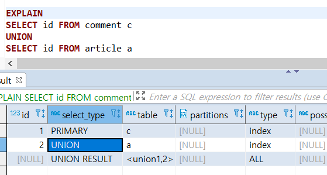
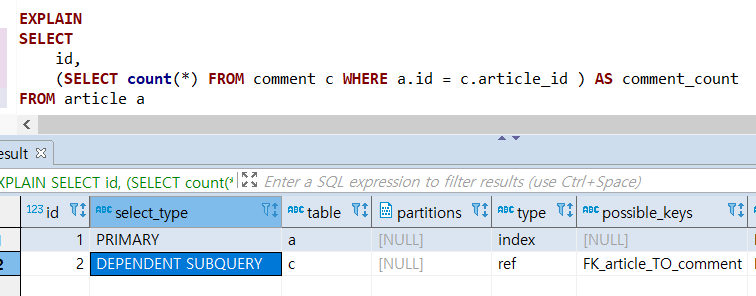
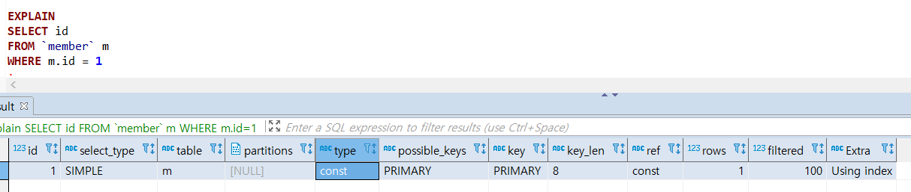
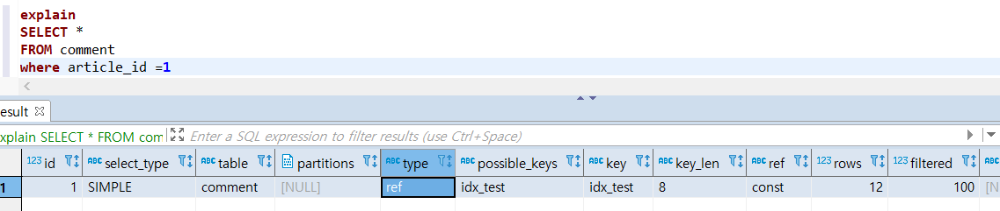

# Real MySQL

# 6. 실행 계획 
- DBMS의 옵티마이저는 쿼리를 최적으로 실행하기 위해 각 테이블의 데이터가 어떤 분포로 자장돼 있는지 통계 정보를 참조하여, 기본 데이터를 비교해 최적의 실행 계획을 수립한다. 
- MySQL에서는 EXPLAIN이라는 명령으로 쿼리의 실행 계획을 확일할 수 있다. 

## 6.1.1 쿼리 실행 절차 
1. `사용자로부터 요청된 SQL 문장을 잘게 쪼개서 MySQL 서버가 이해할 수 있는 수준으로 분리한다.`
  -  `SQL 파서`에서 처리 
  - SQL 문장이 문법적으로 잘못됐다면 이 단계에서 걸러진다. 
  - MySQL 서버는 SQL 문장 그 자체가 아니라 SQL 파스 트리를 이용해 쿼리를 실행
2. `SQL의 파싱 정보(파스 트리)를 확인하면서 어떤 테이블부터 읽고 어떤 인덱스를 이용해 테이블을 읽을지 선택한다.`
  - SQL 파스 트리를 참조하면서 다음과 같은 내용을 처리 
    + 불필요한 조건의 제거 및 복잡한 연산의 단순화 
    + 여러 테이블의 조인이 있는 경우 어떤 순서로 테이블을 읽을지 결정 
    + 각 테이블에 사용된 조건과 인덱스 통계 정보를 이용해 사용할 인덱스 결정
    + 가져온 레코드들을 임시 테이블에 넣고 다시 한번 가공해야 하는지 결정
  - `옵티마이저`에서 최적화 및 실행 계획 수립 =>그 결과 `실행 계획` 만들어짐 
3. `두 번째 단계에서 결정된 테이블의 읽기 순서나 선택된 인덱스를 이용해 스토리지 엔진으로부터 데이터를 가져온다.` 
  - MySQL 엔진과 스토리지 엔진이 동시에 참여

## 6.3.1 통계 정보 
- 비용 기반 최적화에서 가장 중요한 것은 통계 정보이다.
- 통계 정보가 정확하지 않다면 전혀 엉뚱한 방향으로 쿼리를 실행해 버릴 수 있기 때문이다. 
- MySQL에서 관리되는 통계 정보는 대략의 레코드 건수와 인덱스의 유니크한 값의 개수 정도가 전부이다. 
- MySQL에서 통계 정보는 순간순간 자동으로 변경되기 때문에 동적인 편이다. 
- 하지만 레코드 건수가 많지 않으면 통계 정보가 상당히 부정확한 경우가 많으므로 'ANALYZE' 명령을 이용해 강제적으로 통계 정보를 갱신해야 할 때도 있다. 

## 6.2 실행 계획 분석
- 쿼리 실행 계획을 확인하려면 `EXPLAIN` 명령을 사용하면 된다. `EXPLAIN EXTENDED`나 `EXPLAIN PARTITIONS` 명령을 이용해 더 상세한 실행 계획을 확인할 수 있다. 
- 실행 순서는 위에서 아래로 순서대로 표시된다(UNION이나 상관 서브쿼리와 같은 경우 순서대로 표시되지 않을 수도 있다).
- 출력된 실행 계획에서 위쪽에 출력된 결과일수록 쿼리의 바깥 부분이거나 먼저 접근한 테이블이고, 아래쪽에 출력된 결과일수록 쿼리의 안쪽 부분 또는 나중에 접근한 테이블에 해당된다. 
- `UPDATE, INSERT, DELETE 문장에 대해서는 실행 계획을 확인할 방법이 없다.` 
- 
### id 컬럼 
- id 값이 작을수록 쿼리의 바깥 부분이거나 먼저 접근한 테이블이고, id 값이 클수록 쿼리의 안쪽 부분 또는 나중에 접근한 테이블에 해당된다. 
- 단위 SELECT 쿼리별로 부여되는 식별자 값 
- 만약 하나의 SELECT 문장 안에서 여러 개의 테이블을 조인하면 조인되는 테이블의 개수만큼 실행 계획 레코드가 출력되지만 같은 id가 부여된다. 
  + id 1, select_type = SIMPLE, table = e
  + id 1, select_type = SIMPLE, table = s
```sql
EXPLAIN
SELECT e.emp_no, e.first_name, s.from_date, s.salary
FROM employees e, salaries s
WHERE e.emp_no=s.semp_no
LIMIT 10;
```

- 
### select_type 칼럼
- SIMPLE  
  + UNION이나 서브 쿼리를 사용하지 않는 `단순한 SELECT` 쿼리인 경우
- PRIMARY  
  + UNION이나 서브 쿼리가 포함된 SELECT 쿼리의 실행 계획에서 가장 바깥쪽에 있는 단위 쿼리인 경우
- UNION  

  + UNION으로 결합하는 단위 SELECT 쿼리 가운데 첫 번째를 제외한 두 번째 이후 단위 SELECT 쿼리인 경우. 
- DEPENDENT  

 + 내부 쿼리가 외부의 값을 참조해서 처리될 때
 + 일반적으로 서브쿼리는 외부 쿼리보다 빠르게 처리되므로 먼저 실행되는데, `DEPENDENT SUBQUERY의 경우 외부 쿼리에 의존적이므로 절대 외부 쿼리보다 먼저 실행될 수 가 없기 때문에 비효율적인 경우가 많다.` 
 ```sql
  SELECT 
    name,
    (SELECT id FROM dpm dp WHERE e.id=dp.id)
  FROM emp e 
 ```
- UNION RESULT  

  + UNION의 결과를 담는 임시 테이블이다. 실제 단위 쿼리가 아니기 때문에 별도로 id값은 부여되지 않는다. 
- SUBQUERY  
  + FROM 절 이외에 사용되는 서브 쿼리
- DERIVED  
  + FROM 절에서 사용된 서브쿼리. 실행 결과를 메모리나 디시크에 임시 테이블을 생성한다. 
  + FROM 절에 사용된 서브 쿼리를 제대로 최적화하지 못할 때가 대부분이고, 파생 테이블에는 인덱스가 전혀 없으므로 다른 테이블과 조인할 때 성능상 안좋을 때가 많다. 
  + MySQL 6.0 이상부터는 최적화되서 FROM 절에 서브쿼리 써도 잘 안나옴
- `select_type에 DERIVED이 있으면 SUBQUERY 대신 JOIN으로 쿼리를 바꾸는 게 좋다.`   

### table 칼럼
- MySQL의 실행 계획은 단위 SELECT 쿼리 기준이 아니라 `테이블 기준`으로 표시된다.
- 만약 테이블의 이름에 별칭이 부여된 경우에는 별칭이 표시된다. 
- 별도의 테이블을 사용하지 않는 SELECT 쿼리인 경우에는 NULL로 표시된다. 
- `<>`로 둘러싸인 이름은 `임시 테이블`을 의미한다. <> 안에 표시되는 숫자는 SELECT 쿼리의 id를 지칭한다. 

### type 칼럼 
- 쿼리의 실행 계획에서 type 이후의 칼럼은 MySQL 서버가 각 테이블의 `레코드를 어떤 방식으로 읽었는지를 의미`한다. 각 테이블의 `접근 방식(Access type)`으로 해석
- ALL을 제외한 나머지는 모두 인덱스를 사용하는 접근 방법이다.
  + ALL은 인덱스를 사용하지 않고, 테이블을 처음부터 끝까지 읽어서 레코드를 가져오는 풀 테이블 스캔 접근 방식을 의미한다. 
- `하나의 단위 SELECT 쿼리는 접근 방법 중에서 단 하나만 사용할 수 있다.`
- `index_merge를 제외한 나머지 접근 방법은 반드시 하나의 인덱스만 사용한다.` 
- `system`  
  + 레코드가 1건만 존재하는 테이블 또는 한 건도 존재하지 않는 테이블을 참조하는 형태의 접근 방법 
  + MyISAM이나 MEMORY 테이블에서만 사용되는 접근 방법. InnoDB 테이블에서는 ALL 또는 index로 표시될 가능성이 높다.  
  + 레코드가 1건 이하인 경우에만 사용할 수 있는 접근 방법이므로 실제 애플리케이션에서 사용되는 쿼리의 실행 계획에서는 `거의 보이지 않는다.`
- `const`  

  + `테이블 레코드 건수에 관계없이 쿼리가 프라이머리 키나 유니크 키 칼럼을 이용하는 WHERE 조건절을 가지고 있으며, 반드시 1건을 반환하는 쿼리의 처리 방식(동등 조건 검색)` 
  + 다른 DBMS에서는 유니크 인덱스 스캔라고 표현한다.  

  + `다중 컬럼으로 구성된 프라이머리 키나 유니크 키 중에서 인덱스의 일부 컬럼만 조건으로 사용할 때는 const 타입의 접근 방법을 사용할 수 없다.` 이 경우에는 실제 레코드가 1건만 저장되있더라도 MySQL 엔진이 데이터를 읽어보지 않고서는 레코드가 1건이라는 것을 확실할 수 없기 때문이다. 위 그림에서는 (article_id, parent_comment_id)를 복합 인덱스로 설정해놓고 const가 되는지 확인한 예제이다.
- `eq_ref`  
  + 여러 테이블이 조인되는 쿼리의 실행 계획에서만 표시된다. 
  + `조인에서 첫 번째 읽은 테이블의 칼럼값을 이용해 두 번째 테이블을 프라이머리 키나 유니크 키로 동등 조건 검색(두 번째 테이블은 반드시 1건의 레코드만 반환)`
- `ref`  
  + `조인의 순서와 인덱스의 종류에 관계없이 동등 조건으로 검색(1건의 레코드만 반환된다는 보장이 없어도 됨)` 
- `const`, `eq_ref`, `ref` 접근 방식 모두 WHERE 조건절에 사용되는 비교 연산자는 동등 비교 연산자("=" or "<=>")이어야 한다라는 공통점이다. 세 가지 모두 매우 좋은 접근 방법으로 인덱스의 분포도가 나쁘지 않다면 성능상의 문제를 일으키지 않는 접근 방법이다. 쿼리를 튜닝할 때도 이 세 가지 접근 방법에 대해서는 크게 신경 쓰지 않고 넘어가도 무방하다. 
- fulltext  
  + 비용 기반의 옵티마이저에서는 통계 정보를 이용해 비용을 계산해서 실행 계획을 선택하지만, 전문 검색 인덱스는 통계 정보가 관리되지 않고 다른 SQL 문법을 사용해야 한다. 
  + 옵티마이저는 전문 검색 인덱스를 사용하는 SQL에서는 쿼리의 비용과는 관계없이 거의 매번 fulltext 접근 방법을 사용한다. 
    - 물론, fulltext 접근 방법보다 명백히 빠른 const나 eq_ref 또는 ref 접근 방법을 사용할 수 있는 쿼리에서는 억지로 fulltext 접근 방법을 선택하지는 않음
  + 전문 검색은 "MATCH ... AGAINST ... " 구문을 사용해서 실행하는데, 반드시 해당 테이블에 전문 검색용 인덱스가 준비돼 있어야만 한다. 
```sql
EXPLAIN
SELECT *
FROM employee_name 
WHERE emp_no BETWEEN 10001 AND 10005
AND MATCH(first_name, last_name) AGAINST('Facello' IN BOOLEAN MODE);
```  
- ref_or_null  
  + ref 접근 방식과 같은데, NULL 비교가 추가된 형태다. 실무에서 자주 쓰이진 않음 
```sql
EXPLAIN
SELECT * FROM titles WHERE to_date='1999-03-01' OR to_date IS NULL;
```  
- unique_subquery  
  + IN(subquery) 형태의 조건에서 subquery의 반환 값에는 중복이 없으므로 별도의 중복 제거 작업이 필요하지 않음 
- index_subquery  
  + IN(subquery) 형태의 조건에서 subquery의 반환 값에는 중복된 값이 있을 수 있지만 인덱스를 이용해 중복된 값을 제거할 수 있음 
- range  
  + range는 인덱스를 하나의 값이 아니라 범위로 검색하는 경우를 의미하는데, 주로 "<, >, IS NULL, BETWEEN, IN, LIKE" 등의 연산자를 이용해 인덱스를 검색할 때 사용된다. 
  + MySQL이 가지고 있는 접근 방법 중에서 상당히 우선순위가 낮지만 빠르다. 
- index_merge  
  + 2개 이상의 인덱스를 이용해 각각의 검색 결과를 만들어 낸 후 병합하는 처리 방식이다.     
- index  
  + index 접근 방식은 인덱스를 처음부터 끝까지 읽는 `인덱스 풀 스캔`을 의미한다. 
  + range 접근 방식과 같이 필요한 부분만 효율적으로 읽는 게 아니다. 
  + 인덱스는 일반적으로 데이터 파일 전체보다는 크기가 작아서 풀 테이블 스캔보다는 효율적이므로 풀 테이블 스캔보다는 빠르게 처리된다. 
- ALL  
  + 테이블을 처음부터 끝까지 전부 읽어서 불필요한 레코드를 제거하고 반환한다.
  + 위의 방법으로는 처리할 수 없을 때 가장 마지막에 선택되는 가장 비효율적인 방법이다. 
  + 대량의 레코드를 처리하는 쿼리에서는 잘못된 쿼리 튜닝보다 더 나은 방법이 되기도 한다. `쿼리 튜닝한다는 것이 무조건 인덱스 풀 스캔이나 테이블 풀 스캔을 사용하지 못하도록 하는게 아니다.`

### 6.2.5 possible_keys
+ possible_keys 칼럼에 있는 내용은 MySQL 옵티마이저가 최적의 실행 계획을 만들기 위해 후보로 선정했던 접근 방식에서 사용되는 인덱스의 목록일 뿐이다. 즉, 사용될 법했던 인덱스의 목록이다. 
+ `쿼리를 튜닝하는 데 아무런 도움이 되지 않으므로 그냥 무시하자.`

### 6.2.6 key
- 최종 선택된 실행 계획에서 사용하는 인덱스를 의미한다. 
- 쿼리를 튜닝할 때, 의도했던 인덱스가 표시되는지 Key 컬럼으로 확인하는 것이 중요하다. 
  + index_merge가 실행 계획일 경우 key 컬럼에는 ","로 구분되어 표시된다. 

### 6.2.7 key_len
- 쿼리를 처리하기 위해 다중 컬럼으로 구성된 인덱스에서 몇개의 컬럼까지 사용했는지를 알려준다. 


