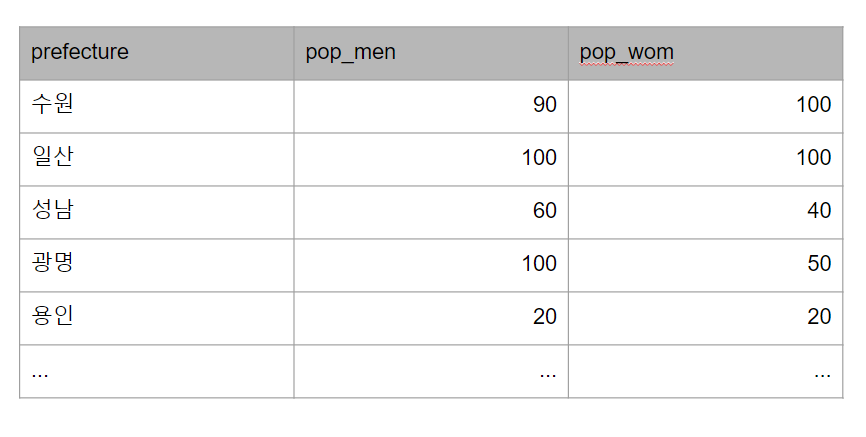
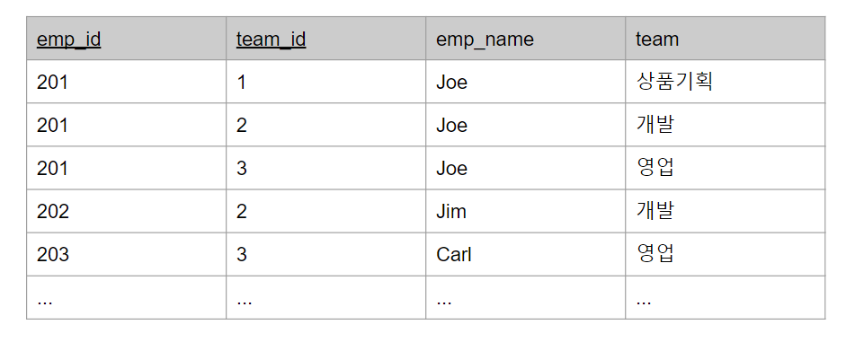
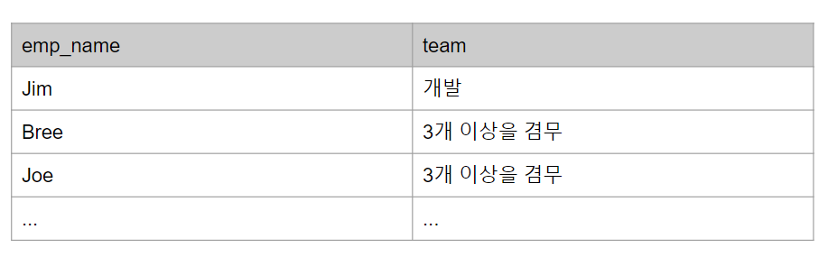

# SQL 레벨업 
: DB 성능 최적화를 위한 SQL 실전 가이드
: 미크 지음, 윤인성 옮김, 한빛미디어
- [3장 SQL의 조건 분기](#3장-SQL의-조건-분기)

# 3장 SQL의 조건 분기
:구문에서 식으로 
## 8강 UNION을 사용한 쓸데없이 긴 표현 
- UNION을 사용한 조건 분기는 SQL 초보자가 좋아하는 기술 중 하나이다.
- 일반적으로 이러한 조건 분기는, WHEE 구만 조금씩 다른 여러 개의 SELECT 구문을 합쳐서, 복수의 조건에 일치하는 하나의 결과 집합을 얻고 싶을 때 사용한다. 
- 하지만 이런 방법은 성능적인 측면에서 굉장히 큰 단점을 갖고있다. 
- 외부적으로는 하나의 SQL 구문을 실행하는 것처럼 보이지만, 내부적으로는 여러 개의 SELECT 구문을 실행하는 실행 계획으로 해석되기 때문이다.
- 따라서 테이블에 접근하는 횟수가 많아져서 I/O 비용이 크게 늘어난다. 
- `예외적인 몇 가지 상황을 제외하면 UNION을 사용하지 않는 것이 성능적으로도 좋고 가독성도 좋다.` 
### 1. UNION을 사용한 조건 분기와 관련된 간단한 예제
- 2001년 까지는 세금이 포함되지 않은 가격을, 2002년부터는 세금이 포함된 가격을 'price' 필드로 표시하여라
```sql
SELECT item_name, year, price_tax_ex AS price
FROM items
WHERE year <= 2001
UNION ALL 
SELECT item_name, year, price_tax_ex AS price 
FROM items
WHERE year >= 2002
;
```
- UNION을 사용했을 때의 실행 계획 문제
  + 쓸데없이 길다.
  + 거의 같은 두 개의 쿼리를 두 번이나 실행하고 있다. (성능)
- UNION 쿼리는 items에 TABLE ACCESS FULL로 2번 접근하고 있으므로, 읽어들이는 비용도 테이블의 크기에 따라 선형으로 증가하게 된다. 
- 물론 데이터 캐시에 테이블의 데이터가 있으면 어느 정도 완화되겠지만, 테이블의 크기가 커지면 캐시 히트율이 낮아지므로 그러한 것도 기대하기 힘들어진다. 
- UNION은 굉장히 편리한 도구지만 정확한 판단 없이 SELECT 구문 전체를 여러 번 사용해서 코드를 길게 만드는 것은 쓸데없는 테이블 접근을 발생시키며 SQL의 성능을 나쁘게 만든다. 또한 물리 자원도 쓸데없이 소비하게 된다. 
### 2. WHERE 구에서 조건 분기를 하는 사람은 초보자
- SELECT 구만으로 조건 분기를 하면 다음과 같이 최적화할 수 있다. 
```sql
SELECT item_name, year, 
    CASE WHEN year <= 2001 THEN price_tax_ex
         WHEN year >= 20002 THEN price_tax_in 
         END AS price 
FROM items
```
- UNION을 사용한 쿼리와 같은 결과를 출력하지만 성능적으로 훨씬 좋은 쿼리이다.(테이블이 크기가 커질수록 명확하게 드러남)
### 3. SELECT 구를 사용한 조건 분기의 실행 계획
- 실행 계획을 살펴보면, item 테이블에 대한 접근이 1회로 줄고, 가독성이 좋아졌다 
- UNION을 사용한 분기는 SELECT '구문'을 기본 단위로 분기하고 있다. 구문을 기본 단위로 사용하고 있다는 점에서, 아직 절차 지향형의 발상을 벗어나지 못했다. 반면 CASE 식을 사용한 분기는 문자 그대로 '식'을 바탕으로 하는 사고이다.
- `'구문'에서 '식'으로 사고를 변경`하는 것이 SQL을 마스터 하는 열쇠 중 하나이다. 

## 9강 집계와 조건 분기
- 집계를 수행하는 쿼리를 작성할 때, 쓸데없이 길어지는 경우를 자주 볼 수 있다. 
- 예제 

- 원하는 결과

### 1. 집계 대상으로 조건 분기 
- UNION을 사용한 방법
  + UNION을 이용해 절차 지향적으로 풀기
  ```sql
  SELECT prefecture, 
         SUM(pop_men) AS pop_men,
         SUM(pop_wom) AS pop_wom,
  FROM (
            SELECT prefecture, pop AS pop_men, NULL as pop_wom
            FROM population
            WHERE sex = '1'
            UNION
            SELECT prefecture, NULL AS pop_men, pop as pop_wom
            FROM population
            WHERE sex = '2'
       ) TMP
  GROUP BY prefecture;     
  ```
- UNION의 실행 계획
  + FULL SCAN 2회 발생
  + 만약, sex 필드에 인덱스가 존재하면 조건분기 보다 UNION 식이 더 빠르게 작동할 수 있다.
- 집계의 조건 분기도 CASE 식을 사용
  + 원래 SQL은 이러한 결과 포맷팅을 목적으로 만들어진 언어가 아니지만 실무에서 자주 사용되는 기술이다. 
  + SELECT 구문을 사용한 조건 분기의 경우 쿼리가 간단해진다. 
  ```sql
  SELECT prefecture,
         SUM(CASE WHEN sex = '1' THEN pop ELSE 0 END) AS pop_men,
         SUM(CASE WHEN sex = '2' THEN pop ELSE 0 END) AS pop_wom
  FROM population
  GROUP BY prefecture       
  ```  
- CASE 식의 실행 계획 
  + FULL SCAN 1회 발생
  + UNION을 사용한 경우에 비해 I/O 비용이 절반으로 감소
  + `CASE식으로 조건 분기를 잘 사용하면 UNION을 사용하지 않을 수 있다. 또한, 성능적인 측면에서도 좋다`

### 2. 집약 결과로 조건 분기
- 집약에 조건 분기를 적용하는 또 하나의 패턴으로, 집약 결과에 조건 분기를 수행하는 경우
- 예제
  
  1. 소속된 팀이 1개라면 해당 직원은 팀의 이름을 그대로 출력한다
  2. 소속된 팀이 2개라면 해당 직원은 '2개를 겸무'라는 문자열을 출력한다
  3. 소속된 팀이 3개라면 해당 직원은 '3개 이상을 겸무'라는 문자열을 출력한다
- 원하는 결과

- UNION을 사용한 조건 분기
  ```sql
  SELECT emp_name,
         MAX(team) AS team
  FROM employees
  GROUP BY emp_name
  HAVING COUNT(*) = 1
  UNION
  SELECT emp_name,
         '2개를 겸무' AS team
  FROM employees
  GROUP BY emp_name
  HAVING COUNT(*) = 2
  UNION
  SELECT emp_name,
         '3개 이상을 겸무' AS team
  FROM employees
  GROUP BY emp_name
  HAVING COUNT(*) = 3
  ```   
- UNION의 실행 계획
  + 3개의 쿼리를 머지하는 쿼리이므로 테이블 접근을 3번 한다.
- CASE 식을 사용한 조건 분기 
  ```sql
  SELECT emp_name,
         CASE WHEN COUNT(*) = 1 THEN MAX(team)
              WHEN COUNT(*) = 2 THEN '2개를 겸무'
              WHEN COUNT(*) >= 3 THEN '3개 이상을 겸무'
         END AS team     
  FROM employees
  GROUP BY emp_name
  ```     
- CASE 식을 사용한 조건 분기의 실행 계획  
  + CASE 식을 사용하면 테이블을 1번 한다.
  + 집약 결과(COUNT 또는 SUM과 같은 약 함수의 결과)는 1개의 레코드로 압축된다. 

## 10강 그래도 UNION이 필요한 경우 
- UNION을 사용할 수 밖에 없는 경우
  + `머지 대상이 되는 SELECT 구문들에서 사용하는 테이블이 다른 경우`
- UNION을 사용하는 것이 성능적으로 더 좋은 경우 
  + `UNION을 사용했을 때 좋은 인덱스(압축을 잘 하는 인덱스)를 사용`하지만, 이외의 경우에는 테이블 풀 스캔이 발생한다면, UNINO을 사용한 방법이 성능적으로 더 좋을 수 있다. 

## 11강 절차 지향형과 선언형
- 구문 기반과 식 기반 
  + UNION이라는 것 자체가 구문을 바탕으로 하는 절차 지향적인 체계를 사용하기 때문에, SQL 초보자가 많이 사용한다. 
  + UNION으로 연결하는 대상은 SELECT 구문이다. 따라서 절차 지향형 프로그래밍 언어에 익숙한 사람들에게 굉장히 익숙한 방식인 것이다.
  + 하지만 SQL의 기본적인 체계는 선언형이다. 이 세계의 주역은 '구문'이 아니라 '식'이다.
  + SQL 구문의 각 부분(SELECT, FROM, WHERE, GROUP BY, HAVING, ORDER BY)에 작성하는 것은 모두 식이다. 열 이름 또는 상수만 기술하는 경우에도 마찬가지이다. 
  + SQL 구문 내부에는 식을 작성하지, 구문을 작성하지 않는다. 

## 3장 마치며 
- SQL의 성능은 저장소의 I/O를 얼마나 감소시킬 수 있을지가 열쇠
- UNION에서 조건 분기를 표현한다면 "내가 지금 쓸데없이 길게 쓰고 있는 것은 아닐까?"라는 것을 항상 의식할 것
- IN 또는 CASE 식으로 조건 분기를 표현할 수 있다면, 테이블의 스캔을 크게 감소시킬 가능성 있음
- 구문에서 식으로의 패러다임 전환을 연습 필요 


# [4장 집약과 자르기] 
: 집합의 세계 
## 12강 집약
- 집약 함수 
  + COUNT
  + SUM
  + AVG
  + MAX
  + MIN 
###  여러 개의 레코드를 한 개의 레코드로 집약 
- GROUP BY구의 특징은 '여러 개의 레코드를 한 개의 레코드로 집약'이다.
- 집약, 해시, 정렬
  + 집약 쿼리의 실행 계획은 '해시' 알고리즘을 사용한다.
  + 하지만 경우에 따라서는 정렬을 사용하기도 한다. 
  + 최근에는 GROUP BY를 사용하는 집약에서 정렬보다 해시를 사용하는 경우가 많다. 이는 GROUP BY 구에 지정되어 있는 피드를 해시 함수를 사용해 해시키로 변환하고, 같은 해시 키를 가진 그룹을 모아 집약하는 방법이다. 
  + 정렬과 해시 모두 메모리를 많이 사용하므로, 충분한 해시용(또는 정렬용) 워킹 메모리가 확보되지 않으면 스왑이 발생한다. 따라서 저장소 위의 파일이 사용되면서 굉장히 느려진다.
  + 연산 대상 레코드 수가 많은 GROUP BY 구(또는 집약 함수)를 사용하는 SQL에서는 충분한 성능 검증을 실행해줘야 한다. 

## 13강 자르기 
- GROUP BY 구는 집약 이외에도 한 가지 중요한 기능이 더 있다. 바로 '자르기'라는 기능이다. 이는 원래 모집합인 테이블을 작은 부분 집합들로 분리하는 것이다. 
- GROUP BY 기능
  + 자르기 
  + 집약 
- 파티션
  + GROUP BY구로 잘라 만든 하나하나의 부분 집합을 수학적으로는 '파티션'이라 부른다. 
- `GROUP BY 구에서 CASE 식 또는 함수를 사용해도 실행 계획에는 영향이 없다.` 물론 단순한 필드가 아니라 필드에 연산을 추가한 식을 GROUP BY 구의 키로 한다면 어느 정도 CPU 연산에 오버 헤드가 발생한다.
- `집약 함수와 GROUP BY의 실행 게획은 성능적인 측면에서, 해시(또는 정렬)에 사용되는 워킹 메모리의 용량에 주의하라는 것 이외에 따로 주의할 사항은 없다.`
- PARTITION BY 구를 사용한 자르기
  + `'GROUP BY 구에서 집약 기능을 제외하고 자르는 기능만 남긴 것이 윈도우 함수의 PARTITION BY구'`
  + PARTITION BY 구는 입력에 정보를 추가할 뿐이므로 원본 테이블 정보를 완전히 그대로 유지한다.

## 4장을 마치며 
- `GROUP BY 구 또는 윈도우 함수의 PARTITION BY 구는 집합을 자를 때 사용` 
- `GROUP BY 구 또는 윈도우 함수는 내부적으로 해시 또는 정렬 처리를 실행` 
- `해시 또는 정렬은 메모리를 많이 사용한다. 만약 메모리가 부족하면 일시 영역으로 저장소를 사용해 성능 문제를 일으킨다`
- `GROUP BY 구 또는 윈도우 함수와 CASE 식을 함께 사용하면 굉장히 다양한 것을 표현할 수 있다.`   

