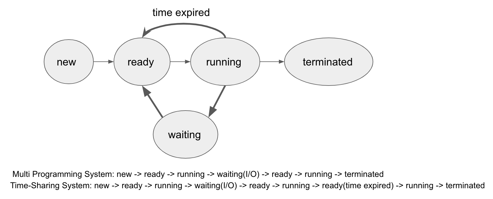

KOCW 운영체제 
==
- 경성대학교 양희재 교수님 
- http://www.kocw.net/home/m/search/kemView.do?kemId=978503
- 운영체제는 프로세스관리, 메모리관리, 파일관리가 가장 중요 !
- 프로세스 관리, 메모리 관리를 중점적으로 볼 것! 

# 목차
- [1강 운영체제의 정의와 역할](#1강-운영체제의-정의와-역할)
  + 운영체제 종류
  + 운영체제가 없다면?
  + 운영체제 목적 
  + 컴퓨터 구조
  + 부팅 
  + 운영체제 구성(커널 + 셸)
- [2강 운영체제 역사](#2강-운영체제-역사)
  + operator
  + Batch processing system 
  + multi programming sysytem 
  + time-sharing system
- [3강 고등 운영체제, 인터럽트 기반 시스템](#3강-고등운영체제-인터럽트-기반-운영체제)
  + 고등 운영체제
    * 다중 프로세서 시스템
    * 분산 시스템
    * 실시간 시스템 
  + 인터럽트 기반 시스템
    * 하드웨어 인터럽트
    * 소프트웨어 인터럽트 
    * 내부 인터럽트   
- [4강 이중모드, 하드웨어 보호](#4강-이중모드-하드웨어-보호)
  + 이중모드
    * 사용자모드, 관리자모드
  + 하드웨어 보호
    * 입출력 장치 보호 - OS에게 요청 
    * 메모리 보호 - MMU 
    * CPU 보호 - timer 
- [5강 운영체제 서비스](#5강-운영체제-서비스)
  + 프로세스 관리
  + 주기억장치 관리 
  + 파일 관리
  + 보조기억장치 관리
  + 입출력 장치 관리
  + 시스템 콜
- [6강 프로세스 관리](#6강-프로세스-관리)  
  + 프로그램 vs 프로세스
  + 프로세스 상태(state)
    * Multi Programming System
    * Time-Sharing System
  + PCB(Process Control Block)
  + Queues
    * Job Queue
    * Ready Queue
    * Device Queue
  + Multi Programming
    * medium-term scheduler
    * context switching


<hr>

# 1강 운영체제의 정의와 역할

## 운영체제 종류
리눅스, Windows, 맥OS

## OS(operating system)가 안깔려있다면?
- 프로세스가 메모리(지멋대로 있는)에 있는 명령들을 가져올 수 없다. => 야생마다. 제어할 수 없음 
- 데이터를 메모리에 올려야 돌아간다. 
- 실행하려면 메모리에 올려야 파일을 읽을 수 있는데 그걸 운영체제가 한다.
- 운영체제가 필요한 파일을 가져다가 메모리에 올려준다.
- 운영체제가 없으면 폭주한다 !!
- 즉, 운영체제가 없으면 사용할 수 없다.

## 운영체제 목적 
- 운영체제는 하드웨어를 잘 관리, 성능향상, 사용자에게 편의성 제공

## 부팅

- 컴퓨터 구조: 프로세서, 메인 메모리(RAM, ROM, 휘발성), 하드디스크(보조메모리), POST, 부트로더
  1) 파워를 키면 프로세서는 롬에있는 메모리를 읽어온다. 
  2) POST(Power-On Self-Test). 내 컴퓨터가 얼마들어있고 메인메모리는 얼마들어있고 키보드, 마우스는 잘 꽂혀있는지 점검
  3) 하드디스크에 OS가 들어있다. 부트로더는 하드디스크에 있는 OS를 메인메모리로 가져온다. => 부팅 
  4) OS가 메인메모리로 올라왔으니 롬은 이제 필요없음! 즉, 파워 킬 때 한 번만 필요
  5) 바탕화면 뜬다 !! 명령 기다리는 중 
  6) ```전원을 끄기 전까지 OS는 메인메모리에 영역 항상 상주하고(resident) 있다.``` 

## 운영체제 구성(커널+셸)
1. ```커널(kernel)```, OS(프로세스)가 관리하는 부분
2. ```명령 해석(shell, command interpreter)```. 
  + 사용자로부터 명령어를 받고 명령어를 해석해 명령을 수행하는 것
  + ex) 마우스 더블클릭
  + $
  + 운영체제를 잘 안다는건 명령어(마우스)를 다룰줄 안다는 것이다.
- 애플리케이션 > 운영체제 > 하드웨어 
- OS가 다르면 애플리케이션은 실행이 안된다. 하드웨어는 같지만 운영체제가 다르기 때문에..
- OS는 자원 관리자(resource manager), 자원 할당자(resource allocator)
```
애플리케이션 : 워드, 엑셀, 게임
OS(커널 부분) : 하드웨어 자원을 관리. CPU(프로세스 관리, 젤중요1). 메모리 관리(젤중요2). 하드디스크 관리(I/O, file). 네트워크 관리. 보안 관리. ...  
H/W: 모니터, 프린터, 키보드, 마우스 ... 
```
<hr>

# 2강 운영체제 역사  
:일괄처리부터 시분할시스템까지 운영체제 변천 역사

## OS 역사
- 옛날에는 CPU가 겁나 비쌌다.
- 옛날엔 컴퓨터를 다뤄주는 operator가 있었다. 
- 1940-50년대에는 운영체제가 없었다. 
- operator 대신 일련의 과정을 일괄적으로 처리하도록 바꾸자!(```Batch Processing System```, 최초의 OS)
 + 초장기에는 메모리에 OS와 1개의 user program(컴파일러, 링커)만 가능했다.
 +I/O는 CPU가 하는 일이 아니기 때문에 CPU가 놀고 있다(idle).
- CPU가 놀고있는 상황이 많아지니 메모리에 user program을 여러개 올리자!(```Multiprogramming System```, 다중프로그래밍, 1960년대)
  + 그 전에는 I/O를 실행할때 CPU는 놀고 있었는데, 이제는 user program 2 일을 한다. 
  + CPU가 I/O를 만나면 다음 user program 으로 넘어가서 일한다.
  + 어느 순간에도 CPU가 idle 하지 않도록 ! 
  + 빠른 CPU, 느린 I/O -> 메모리에 여러 개의 job
  + 이제 여러개의 프로그램의 CPU 스케줄링, 메모리는 어떻게 관리해야할까?
- 키보드, 모니터가 생기면서 대화형(interactive system) 컴퓨터로 발전
- 컴퓨터가 비싸서 여러명서 같이 사용했는데, 일정 시간을 나눠서 CPU가 프로그램마다 일했다. ```Time-sharing system``` ex) linux(unix)
  + 동기화: 여러 프로그램이 순서가 필요
  + 가상메모리: 하드디스크의 일부를 메인메모리처럼 사용. 메인 메모리가 너무 적으니까 하드디스크의 일부를 사용하기 위해
  + 현재 우리가 대부분 사용하는 시스템. windows, mac os, android

## OS 기술 천이
- 규모별
  + 슈퍼컴퓨터 > 서버 > 워크스테이션 > PC > Handheld > Embedded(자동차, 전기밥솥, 냉장고, 세탁기)
  + no OS > Batch > Multiprogramming > Time-sharing > 대형컴퓨터 > 미니컴퓨터
<hr>

# 3강 고등운영체제, 인터럽트 기반 운영체제

## 고등 운영체제 
싱글 CPU에서 발전한 강한(성능) 컴퓨터 종류
- ```다중 프로세스 시스템(Multiprocessor system)```: n개의 CPU와 1개의 메모리
  + 한번에 많은 계산 가능. 성능향상
  + 강한 CPU 1개보다, 약한 CPU 여러개가 이득임
  + CPU 하나가 고장나도 다른 애가 일하면 됨
  + 싱글 CPU와 멀티플 CPU는 스케줄링이 다르다. 
  + 리눅스도 지원 
- ```분산 시스템(Distributed System)```
  + LAN으로 연결되어 있는 느슨한 결합
  + 하나의 일을 메세지를 주고받으며 나눠서 일함. ex) 날씨 계산 
- ```실시간 시스템(Real-time system)```
  + 정해진 시간내에 끝내야한다. 
  + 네비게이션, 공장 자동화 

## 인터럽트 기반 시스템 
- 현대 운영체제는 인터럽트 기반 시스템! 
- 인터럽트 서비스 루틴: 인터럽트를 발생시키면 각 하드웨어, 소프트웨어, 내부 등.. 의 인터럽트가 발생 
  * ```하드웨어 인터럽트```
    + 마우스를 움직이거나 키보드를 두들기면 인터럽트가 발생
    + 부팅 후 바탕화면에서 마우스를 움직이면 전기 신호가 발생(인터럽트), 그러면 하던 일을 중지하고 OS안에 들어있는 마우스 인터럽트 코드를 읽어 마우스의 커서 움직이기
    + 마우스를 더블클릭해서 hwp를 실행시키면, 하드디스크에 있는 hwp 메모리가 메인 메모리로 올라감
    + 인터럽트 결과 운영체제 내의 특정 코드 실행 (ISR)
    + ```OS는 메인메모리에 항상 상주해 있다가, 마우스나, 키보드의 인터럽트가 발생하면 인터럽트 루틴을 처리한다.``` 
  * ```소프트웨어 인터럽트```
    + add, move 등을 호출하면 운영체제에 인터럽트 걸림
    + ```유저 프로그램을 실행하다가 프린트를 사용하고 싶어 인터럽트를 걸면(소프트웨어 인터럽트) CPU는 유저 프로그램을 잠시 멈추고 OS에 프린트 인터럽트를 찾아 처리한 후 다시 유저 프로그램을 동작. 유저 프로그램을 처리하면서 이런 인터럽트 행위가 반복해서 일어날 수 있다.``` 
  * ```내부 인터럽트```
    + 내부 에러 발생 ex) 0으로 나눌 때 
    + 사용자 모드에서 관리자 모드를 실행할 때 
- 하드디스크 코드(내용)를 읽어 오는 인터럽트가 OS 내부에 있다. 
- 현재는 대부분 인터럽트 기반 운영체제 
- OS안에는 여러 루틴이 들어있다. 
<hr>

# 4강 이중모드, 하드웨어 보호

## 이중모드 (dual mode)
- 한 컴퓨터를 여러 사람이 동시에 사용할 때, 한 사람이 잘못해서 서버가 다운될 수 있다. 
- 유저가 stop 같은 명령어가 들어오면 재부팅해야하니 치명적이니 관리자만 가능하게
  + ```사용자 모드, 관리자 모드```
  + ```관리자 모드는 모든 명령어 사용 가능``` 
- CPU 레지스터에 이중 모드를 나타내는 플래그 비트를 하나 추가
  + 운영체제 서비스 실행될 때는 관리자 모드 
  + 사용자 프로그램 실행될 때는 사용자 모드
  + 하드웨어/소프트웨어 인터럽트 발생하면 관리자 모드
  + 운영체제 서비스가 끝나면 다시 사용자 모드 
  + 하나의 프로그램이 실행될 때 관리자모드, 사용자모드가 바뀌어가면서 진행된다. 
- 일반적인 프로그램의 실행
  + 프로그램 적재
  + 유저 모드(키보드, 마우스) > 관리자 모두(ISR) > 유저 모드(모니터, 디스크, 프린터) > 관리자 모드 > 유저 모드 .. 유저모드와 관리자 모드를 왔다갔다 거림 
- 대부분의 컴퓨터는 이중 모드를 지원한다. 
- ```일반 사용자는 절대로 OS 영역, 하드웨어 영역에 직접 접근 못한다.``` 

## 하드웨어 보호  
```직접 접근하지 말고 OS에 요청해서 접근하자```
- 입출력 장치 보호
  + 직접 입출력을 제어하면 잘못된 입출력이 나올 수 있으니 보호해야함 
    * A에 대해 출력하고 있는데 B의 내용을 출력하지 않도록..  
  + 파일 읽을 때 하드디스크에 직접 붙어서 읽지 말고 OS에 요청(소프트웨어 인터럽트). 그러면 OS가 올바른 요청인지 판단 후 제공
  + ```입출력이 필요하면 OS에 요청(소프트웨어 인터럽트)``` 
  + 사용자가 입출력 명령을 직접 내리면 ... OS가 프로그램을 강제 종료시킴
  + 즉, 입출력은 OS가 관리
- 메모리 보호
  + 우연히 또는 고의로 다른 사용자 메모리 또는 운영체제 영역 메모리에 접근한다면?  
  + ```문지기(MMU, memory Management Unit)를 두어 다른 메모리 영역 침범 감시!``` 
  + 다른 영역에 들어오려 하면 segment violation를 발생 시켜 종료 
- CPU 보호
  + 한 프로그램/사용자가 고의로 CPU 시간을 독점할 수 있으니 Timer를 두어 일정 시간 경과 시 타이머 인터럽트걸자 


# 5강 운영체제 서비스 
- 운영체제가 하는일은 우리나라가 하는 일과 비슷하다. 


## 운영체제 서비스


- ```프로세스 관리(process management)``` 
  + 프로세스 : 메모리에서 실행 중인 프로그램
  + 프로세스의 생성, 소멸(creation, deletion)
  + 프로세스 활동 일시 중지, 활동 재개(suspend, resume)
  + 프로세스간 통신(interprocess communication: IPC)
  + 프로세스간 동기화 (synchronization)
  + 교착상태 처리(deadlock handling)
- ```주기억장치 관리(Main memory management)```
  + 프로세스에게 메모리 공간 할당 (allocation)
  + 메모리의 어느 부분이 어느 프로세스에게 할당되었는가 추적 및 감시 
  + 프로세스 종료 및 메모리 회수 (deallocation)
  + 메모리의 효과적 사용
  + 가상 메모리: 물리적 실제 메모리보다 큰 용량 갖도록 (실제 메인메모리는 크기가 작음. 작은걸 하드디스크 처럼 크게 쓰고싶을 때)
- 파일 관리(File management)
  + Track/sector로 구성된 디스크를 파일이라는 논리적 관점으로 보게 
  + 파일의 생성과 삭제
  + 디렉토리의 생성과 삭제 
  + 기본 동작 지원: open, close, read, write, create, delete
  + Track/sector-file 간의 매핑
  + 백업(backup)
- 보조기억장치 관리(Secondary storage management)
  + 하드디스크, 플래시 메모리 등이 있음
  + 빈 공간 관리(free space management)
  + 저장공간 할당(storage allocation)
  + 디스크 스케쥴링(disk scheduling)
- 입출력 장치 관리(I/O device management)
  + 장치 드라이브
  + 입출력 장치의 성능 향상 

## 시스템 콜
- 프로세스가 돌다가 운영체제 서비스를 받기 위한 호출
- ```일반 애플리케이션이 돌다가 OS에게 요청하는 걸 시스템 콜이라고 한다. 시스템 콜은 일반적으로 특정 레지스터에 특정 값을 준 다음, 소프트웨어 인터럽트를 걸고 OS에게 서비스를 받을 수 있다.``` 
- 파일을 만들고 싶으면 파일명, 만들고 싶다는 명령어만 입력해주면 OS가 알아서 파일 만들고, 저장위치(트랙, 섹터) 배정해줌 => OS를 서비스를 받는거임 => 시스템 콜
<hr>

# 6강 프로세스 관리

## 프로세스 
- 프로그램 vs 프로세스 (program vs process)
  + ```무덤 속 프로그램```. 하드디스크에 잠들어 있는 프로그램
  + ```살아 움직이는 프로세스```. 메모리를 할당받아 실행 중인 프로그램. (== task, job)
- 프로세스 상태 

  + new: 메인 메모리로 올라 온 상태 
  + ready: 초기화를 마치고 실행 준비 중인 상태 
  + running: 실행 상태
  + waiting: 기다리는 상태 
  + terminated: 끝난 상태
  + 멀티 프로그래밍 시스템: new -> ready -> running -> waiting(갑자기 다른 요청이 왔을 때, I/O) -> ready -> running -> terminated
  + Time-Sharing System: new -> ready -> running -> waiting(I/O) -> ready -> running -> ready(time expired) -> running -> terminated

## PCB(Process Control Block)
- ```하나의 프로세스에 한 개의 PCB 할당```
- ```프로세스에 대한 모든 정보 있음```
  + time expired라던지 등 으로 인해 다른 프로세스로 옮기기 전에 현 프로세스의 상태를 저장해놓음 
  + process state, PC 번지 정보, registers, MMU info(base, limit), process id, list of open files  ...
- PCB는 프로세스 관리 부서 내부에 있다.!  
- 정부에서 개인 정보를 관리하는 것과 비슷하다. 정부 = 프로세스 관리 부서, PCB = 개인 정보 관리
- OS에 자료구조 형태로 들어가있음 

## Queues
각 큐에는 프로세스들이 대기하고 있음 
- ```Job Queue```
  + 하드디스크에는 수 많은 job들이 있는데, 바로 메인 메모리에 올라갈 수 없고 queue에 대기해야 한다.
  + 하드디스크 -> job queue -> 메인메모리
  + ```job scheduler```: job 중에 어떤 애를 먼저 메인메모리에 올릴까(== Long-term scheduler)
    * OS 안에 들어있음. 프로세스 관리부서  
- ```Ready Queue```    
  + 메인메모리 -> ready queue -> OS 서비스
  + ```CPU scheduler```: 어느 프로세스를 선택해서 OS 서비스를 해야 할까(== Short-term scheduler)
- ```Device Queue```
  + I/O도 queue에 줄서서 기다려야한다.
  + 하드디스크를 사용하려면 줄서라!
  + ```Device scheduler```: 어느 놈을 먼저 디스크 서비스를 받게 해줄까 
  + 메인 메모리에 CPU, I/O 작업이 존재할 때는 CPU가 놀지 않게 CPU, I/O 작업을 적절히 골라 메인에 올리기

## 멀티 프로그래밍  
- medium-term scheduler
  + 메인 메모리에 올라와 있는 프로세스 중 일정 시간 동안 사용되지 않는 프로세스를 찾아 하드디스크의 backing store에 swap 해놓음(swap out). 비어있는 공간에 어떤 프로세스를 가져오는 것(swap in) (OS는 메인 메모리에 있는 프로세스들을 항상 주시하고 있음)
  + 메인 메모리가 복잡할 때 어떤 걸 swapping 할까
  + swapping: 사용하지 않는.. 비어있는 프로세스 자리를 swap 해서 사용하기 
- ```context switching``` (문맥전환)
  + P1을 진행하다가 P2로 바꾸는 것 
  + ```P1의 현재 상태를 PCB1에 저장. P2의 저장된 값을 복원(restore)``` -> OS안에 Dispatcher가 이 일을 해줌
  + Context switching overhead 발생  
<hr>

# 7, 8, 9 강 CPU 스케쥴링 알고리즘
- ready queue 안에 있는 프로세스들
- Preemptive vs Non-preemptice
  + 선점 : 비선점 
    * ```선점```: 프로세스를 실행 중에 강제로 끼여들 수 있다. ex) 응급환자
    * ```비선점```: 프로세스를 실행 중에는 중간에 끼여들 수 없다. ex)  일반적인 병원
- Scheduling crieria(스케줄링 척도)
  + CPU Utilization(CPU 이용률, %). 높을수록 좋다 
  + Throughput(처리율, jobs/sec). 얼마나 처리하는가
  + Turnaround time(반환시간, sec). 작업을 끝내고 나올 때 까지 시간 
  + Waiting time(대기시간, sec). CPU 서비스를 받기 위해 얼마나 기다렸는가
  + Response time(응답시간, ). interactive system에서 중요한 척도

## CPU 스케줄링
- ```First-Come, Fist-Served``` (FCFS)
  + 특징
    * 먼저 온 고객을 먼저 서비스해주는 방식
    * 일반적으로 공평한 방법이지만 대기시간 측면에서 보면 좋은 성능은 아니다.
    * 비선점 스케줄링 
  + 문제   
    * Convoy Effect (호위효과)
    * 소요 시간이 긴 프로세스가 초반에 등장하면 효율적이지 않음

- ```Shortest-Job-First``` (SJF)
  + 특징 
    * 소요 시간이 짧은 프로세스 먼저 수행
    * 대기시간을 줄이는 방법에서는 좋은 방법임 
    * ```Nonpreemptive```, 비선점
  + 문제 
    * starvation

- ```Shortest-Remaining-Time-First``` (SRT)  
  + 특징
    * 수행 시간이 짧은 프로세스가 들어오면 그 프로세스를 먼저 수행
    * ```preemptive```, 선점
  + 문제 
    * starvation 
- ```Priority```
  + 특징 
    * 우선순위가 높은 프로세스먼저 서비스 해준다. 
    * 우선 순위는 정수로 표현
    * 작은 숫자가 우선순위가 높다
    * ```선점```: 높은 우선순위가 들어오면 해당 프로세스로 변경, ```비선점```: 더 높은 우선순위 프로세스가 도착하면 Ready queue의 head에 넣음
    * 내부 혹은 외부 요인으로 우선순위 부여
  + 문제  
    * ```starvation(기아)``` 발생 
  + 해결책  
    * againg. 주기적으로 조사해 우선순위 높여주기 
- ```Round-Robin``` (RR)
  + Time-sharing system 에서 많이 쓰임
  + 각 프로세스는 동일한 Time quantum (== time slice)을 할당받아 진행하며, 할당 시간이 끝나면 그 다음 프로세스가 선점하고 ready queue의 제일 뒤에 가서 다시 줄섬 (10 ~ 100 msec)
  + 비선점. Preemptice scheduling
  + Perfermance depends on the size of the time quantum
    * time quantum이 길어지면 FCFS와 같다
    * time quantum이 0이면 context switching overhead 발생
- Multilevel Queue Scheduling
  + 큐를 여러 개 둬서 그룹을 나누기
  + single ready queue -> several separate queues
    * 각각의 Queue에 절대적 우선순위 존재
    * 큐가 여러 개라면 큐마다 다른 스케줄링 방식 택할 수 있다
- Multilevel Feedback Queue Scheduling
 + 여러 개의 Queue
 + q1에서 진행하다가 CPU time이 너무 길어지면 q2로 이동

## 프로세스 생성과 종료 
- 부팅하고 OS가 메인 메모리에 올라가면 최초 프로세스를 하나 생성한다. 
- 프로세스는 프로세스에 의해 만들어진다.
- 트리 모양의 프로세스(부모 프로세스, 자식 프로세스)
- Process Identifier(PID) 존재
- 프로세스 생성
  + 부모 프로세스 복사, fork() 
  + 실행파일을 메모리로 가져오기, exec()
- 프로세스 종료 
  + 해당 프로세스가 가졌던 모든 자원은 O/S에게 반환, exit()

## 쓰레드(Thread)
- ```프로그램 내부의 흐름, 맥```
- 보통 하나의 프로그램은 하나의 맥이 있다 
- 다중 쓰레드(Multithreads)
  + 한 프로그램에 2개 이상의 맥 
  + 맥이 빠른 시간 간격으로 스위칭 된다
  + ```concurrent vs simultaneous```
  + ex) 동영상 플레이어, 웹브라우저, 웹프로세서
- 현재는 CPU가 1개 있을 때만 생각  

## 쓰레드 vs 프로세스 
- context switching이 프로세스 단위에서 쓰레드 단위로 내려옴
- ```스택```을 제외한 코드, 데이터 등의 메모리 공간은 공유
<hr>

# 10강 프로세스 동기화

## 프로세스 동기화
O/S는 관리 부서들의 모임인데 그 중 중요한 부서는 프로세스 관리 부서이다.
프로세스 관리 부서는 중요한 두 가지 일을 한다. 1. ```CPU 스케줄링.``` 2. ```프로세스 동기화(Synchronization)```
- Process Synchronization (== Thread synchronization)
- Processes
  + independent
  + Cooperating: 대부분
    * 다른 프로세스와 영향을 주든지, 영향을 받는지 
    * ex) 전자우편, 파일전송 
- 데이터의 일관성을 유지해야한다. 
- 멀티 쓰레드에서 공통 객체를 사용하면 잘못된 결과가 나올 수 있다
  + 해결
    * 한번에 한 쓰레드만 업데이트 하도록 -> ```임계구역 문제```
<hr>

# 11강 임계구역 문제 
## 임계구역 문제(Critical-Section-Problem)
- ```critical section: 멀티 쓰레드에서 쓰레드가 공통적으로 update로 사용하는 코드 부분```
  + 해결
    * Mutual exclusion(상호타): 오직 한 쓰레드만 진입할 수 있게. 다른 쓰레드가 critical section에 접근하지 못함
    * Progress(진행):  critical section에 실행중인 프로세스가 없으면, 쓰레드 진입 결정은 유한 시간 내에 진행될 수 있다. 
    * Bounded waiting(한정된 대기): P1 가 Critical Section 에 진입 신청 후 부터 받아들여질 때가지, 다른 프로세스들이 Critical Section 에 진입하는 횟수는 제한이 있어야 한다.
- 우리가 진행 순서를 정할 수 있어야 한다. 

# 12강 세마포 
## 동기화 도구
동기화 문제 해결을 위한 소프트웨어 툴 
- ```세마포어(Semaphores)```
  + 상호 배타를 하기 위해 세마포어 사용 
  + 구조
    * 정수형 변수 + 두 개의 동작(P, V)
    * P: Proveren -> acquire()
    * V: Verhogen -> release() 
  + 일반적 사용은 상호 배타   
- ```모니터``` 
  + 자바에서 주로 사용 
  + synchronized 

# 13강 생산자-소비자 문제 
## 전통적 동기화 예제
- 생산자-소비자 문제
  + 생상자가 데이터를 생상하면 소비자는 그것을 소비하는 게 생산자-소비자 문제
  + ```busy-wait``` 문제 발생
    * 생산자는 버퍼가 가득 차면 더 넣을 수 없다. => while 문으로 인해 무한대기
    * 소비자는 버퍼가 비면 뺄 수 없다. => while 문으로 인해 무한대기 
    * 무한대기 상태에서는 CPU가 다른 일을 할 수 없다. 
    * 해결법: while 대신 block이라는 세마포를 하나 더 선언하서 해결. 생산자가 버퍼에 데이터가 가득 차 넣을 수 없다면 block을 걸어놓고, 소비자가 하나 꺼낼 때 생산자를 깨워주자(호출하자). 반대로 소비자가 버퍼에 데이터가 없어서 가져올 데이터가 없으면 block을 걸어놓고, 생산자가 데이터를 삽입할 때 소비자를 깨워주자.
  + 은행 문제랑 비슷한 유형임 
  + 생산자는 버퍼에 계속 + 를 하려하고, 소비사는 버퍼에 계속 - 를 하려 한다. 이로인해 동 임계구역에 동시에 접근하게 된다. 그러면 동기화 문제를 발생하는데, 이 문제를 해결하지 않으면 코드가 실행이 안되거나 이상한 결과가 나올 수 있다. 이를 해결하기 위해 상포배타 방식인 세마포를 이용한다. 

# 14 강 기타 전통적 동기화 문제. 15강 교착상태 
## Readers-Writers Problem
- Reader와 Writer가 DB에 접근하려할 때 발생하는 문제 
- Reader는 critical section에 1개 이상 있을 수 있다. writer에 비해 읽기만 하니까 상관없다. reader가 사용 중일 때는 writer는 못들어옴  
- Writer는 update를 하므로 상호배제 해야한다.
  + 임계 구역 접근할 때 
    * R-R-R 허용
    * R-W 비허용
    * W-W 비허용
    * W-R 비허용
- 변종이 있을 수 있다.  
  + The first R/W problen(Reader한테 우선권)
  + The second R/W problem(Writer한테 우선권)
  + The Third R/W problem

## Dining Philosopher Problem  

- 식사하는 철학자 문제 
  + 원형 테이블에 5명의 철학자, 5개의 젓가락이 있다. 철학자는 생각->식사->생각->식사를  반복
  + 식사하려면 2개(왼쪽, 오른쪽)의 젓가락이 필요하다  
- 모든 철학자가 갑자기 배가고파서 다 왼쪽 젓가락을 들면```starvation``` 발생하면서 ```deadlock```에 빠짐  
- 동기화를 하다보면 간혹 deadlock에 빠짐 

## Deadlock 
왜 일어나는가? 일어나지 않게 하려면 어떻게 해야하는가? 
- 프로세스는 실행을 위해 CPU, 메모리, 파일, 프린터 등 여러 자원을 필요로 한다. 
  + OS가 이걸 잘 나눠주는 역할을 함.
  + 프로세스는 실행을 위해 여러 자원을 필요로 하는데, 어떤 자원은 갖고 있으나 다른 자원은 갖지 못할 때 대기해야함.
  + 다른 프로세스 역시 원하는 자원이 같아서 대기할 때 교착상태에 빠질 수 있다. 꼬리물기
- 모든 조건을 만족하면 교착상태가 일어날 수도 있다 
  + Mutual exclusion(상호 배타)
  + Hold and wait(보유 및 대기)
  + No Preemption(비선점)
  + Circular wait(환형대기) 
- 자원할당도 (Resource Allocation Graph)
  + 어떤 자원이 어떤 프로세스에게 할당되었는가?
  + 어떤 프로세스가 어떤 자원을 할당 받으려고 기다리고 있는가?
  + 자원: 사각형, 프로세스: 원, 할당: 화살표
- 식사하는 철학자 문제를 해결하기 위한 방법은?
  + 홀수 철학자는 왼쪽 들고, 오른쪽 들기. 짝수 철학자는 오른쪽 들고, 왼쪽 들기

## 교착상태 처리
- 교착상태 방지(Deadlock Prevention)
  + 교착상태 4가지 조건 중 한 가지 이상 불만족
  + 상호배타 
    * 자원을 공유 가능하게...프린트나, I/O 등 원천적으로 불가능할 수도 
  + 보유 및 대기   
    * 기아 발생 
  + 비선점
    * 프린트 같은 경우 비선점 불가.. 대부분 불가
  + 환형대기 
    * 자원에 번호를 부여하고, 오름차순으로 자원 요청     
  + 현실상 보유 및 대기, 환형대기만 조작해서 Deadlock 피하기
- 교착상태 회피
  + 프로세스가 자원을 요청할 때 잘못 승인을 했기 때문에 Deadlock이 발생했다고 생각 
  + 운영체제가 자원을 할당할 때 불안전하게 할당하지 않도록 해야 Deadlock을 피할 수 있다. 
- 교착상태 검출 및 복구
  + 현실적으로 Deadlock이 잘 안일어나니까 일어나도록 허용하고 주기적으로 검사하여 Deadlock 발생 시 복구
  + 검사에 따른 추가 부담 .. 오버헤드 발생 
  + 복구에 따른 메모리 부담 .. 이전 상태 기억해야함 
- 교착상태 무시 
  + 교착상태 발생 시 재시동 

# 16강 모니터
## 모니터 
- 세마포는 오래된 동기화 기법 
- 세마포보다 고수준 개념
- 구조
  + 공유자원 + 공유자원 접근함수
  + 2개의 queues
    * ```배타 동기(Mutual exclusion)``` : commom variable에 접근할 수 있는 함수는 오직 하나만 가능. 많은 쓰레드가 있어도 오직 하나만 공통 변수에 접근할 수 있다. ```synchronized``` 키워드 사용하여 지정 
    * ```조건 동기(Conditional synch)``` : wait(), notify(), notifyAll() 메소드 사용 
  + 공유자원 접근함수에는 최대 1개의 쓰레드만 진입 가능하다.   
  + 진입 쓰레드가 조건 동기로 블록되면 새 쓰레드 진입 가능하다.(wait())
  + 새 쓰레드는 조건동기로 블록된 쓰레드를 꺠울 수 있다.(notify())
  + 꺠워진 쓰레드는 현재 쓰레드가 나가면 재진입할 수 있다. 
- 자바의 모든 객체는 모니터가 될 수 있다. 


# 17강 정리와 복습(1)
- CPU 스케줄링 


## 


# 운영체제에서 잡아야 할 흐름!!!
- 운영체제에서 가장 중요한 서비스가 프로세스 관리이다. 
- 프로세스 관리 
  + CPU 스케줄링
  + 프로세스 동기화
    * critical section 문제 풀기 위해 상호배제 하기
    * 효율성 증대
      - busy-wait 하지 않기 
      - orderling 피하기 => 못피하면 deadlock에 빠짐


의문
- time-sharing-system == RR?
- 운영체제 관점에서의 동기화, 개발에서의 동기화 