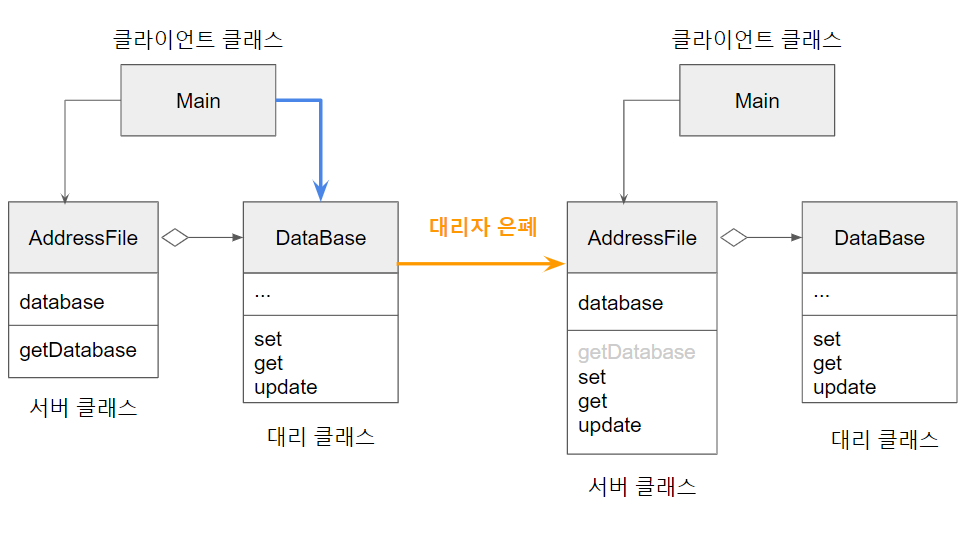

# 자바로 배우는 리팩토링 입문

\[샘플코드]: https://github.com/gilbutITbook/006921

- [0장 리팩토링이란](#0장-리팩토링이란)
- [1장 매직 넘버를 기호 상수로 치환](#1장-매직-넘버를-기호-상수로-치환)
- [2장 제어플래그 삭제](#2장-제어플래그-삭제)
- [3장 어서션 도입](#3장-어서션-도입)
- [4장 널 객체 도입](#4장-널-객체-도입)
- [5장 메서드 추출](#5장-메서드-추출)
- [6장 클래스 추출](#6장-클래스-추출)
- [7장 분류 코드를 클래스로 치환](#7장-분류-코드를-클래스로-치환)
- [8장 분류 코드를 하위 클래스로 치환](#8장-분류-코드를-하위-클래스로-치환)
- [9장 분류 코드를 상태/전략 패턴으로 치환](#9장-분류-코드를-상태전략-패턴으로-치환)
- [10장 에러 코드를 예외로 치환](#10장-에러-코드를-예외로-치환)
- [11장 생성자를 팩토리 메서드로 치환](#11장-생성자를-팩토리-메서드로-치환)
- [13장 상속을 위임으로 치환](#13장-상속을-위임으로-치환)
- [14장 대리자 은폐](#14장-대리자-은폐)

## 0장 리팩토링이란 
- `외부에서 보는 프로그램 동작은 바꾸지 않고 프로그램의 내부 구조를 개선하는 것`
- 리팩토링을 하기 전과 후에 반드시 테스트를 진행해야 한다. `테스트` -> `리팩토링` -> `다시 테스트`
- 리팩토링 목적
  + 버그를 발견하기 쉽게 만든다
  + 기능을 추가하기 쉽게 만든다
  + 리뷰하기 쉽게 만든다 
- 리팩토링의 한계
  + 프로그램이 아직 동작하지 않을 때
  + 시간이 너무 촉박할 때


## 1장 매직 넘버를 기호 상수로 치환
- 매직 넘버를 `상수`나 `enum`으로 바꾸자
  + 매직 넘버만 보고는 숫자의 의미를 알기 어렵다
  + 소스 코드 이곳 저곳에 있으므로 매직 넘버는 수정하기 어려움
- `200` -> `MAX_LENGTH` 
- for문에서는 기호 상수 대신 length를 쓰자
  + for(int i = 0 ; i < `arr.length` ; i ++ )
```java
if (work == 1)
{
    System.out.println("결제합니다")
}
else if (work == 2)
{
    System.out.println("상품을 준비중입니다")
}
else if (work == 3)
{
    System.out.println("배송을 시작합니다")
}
```
- 리팩토링
```java
public static final BUY = 1;
public static final PREPARE_PRODUCT = 1;
public static final DELIVERY = 1;
if (work == BUY)
{
    System.out.println("결제합니다")
}
else if (work == PREPARE_PRODUCT)
{
    System.out.println("상품을 준비중입니다")
}
else if (work == DELIVERY)
{
    System.out.println("배송을 시작합니다")
}
```


## 2장 제어플래그 삭제
: 제어 플래그 때문에 코드가 읽기 어려운 경우
- 문제
  + 제어 플래그를 지나치게 사용하면 처리 흐름을 파악하기 어려움
- 해법  
  + 제어 플래그(flag) 대신에 `break`, `continue`, `return` 등을 써서 처리 흐름을 제어하자
  + 제어 플래그를 사용해야 한다면, flag라는 변수명 대신 변수명을 변경하여 뭘 의미하는지 나타내자 
    + `initialized`, `debug`, `error`, `done`, `interrupted`, `recurse`
- 리팩토링 전
```java
boolean flag = true

if(flag)
{
    result = false;
}
else
{
    result = true;
}

return result;
```
- 리팩토링 후 
```java
if(done)
{
   return false;
}
else
{
    return true;
}

```

## 3장 어서션 도입
: '이렇게 될 것이다'라는 주석이 있는 경우
- 상황 
  + 개발을 하다보면 '여기서 변수 value는 참일 것이다' 또는 '여기서 value > 0'이어야 한다 라는 경우가 생긴다.
- 문제
  + 주석으로 '이런 조건이 성립한다'라고 적어도 프로그램 실행 시 확인되지 않는다.  
- 해법
  + 주석 대신 어서션이라는 기법으로 프로그래머의 의도를 확실히 밝히면 실행 시 조건이 반드시 성립함을 보장할 수 있다. 
- 결과
  + 해당 부분에서 성립해야 할 조건이 명확해지고 소스 코드가 읽기 좋아짐
  + 버그를 빨리 발견 가능함
  + 어서션을 활성화하면 어서션이 성립하는지 자동으로 확인 가능함
  + 어서션을 비활성화하면 어서션이 무시되어 성능이 개선됨 
  + 하지만 어서션을 지나치게 쓰면 읽기 어려워짐  
- `assert value > 0`로 표명한다. 만약 value > 0이 아니라면 java.lang.Error의 하위 클래스인 `java.lang.AssertionError` 예외 발생 
  + 에러 처리 코드는 작성하지 않는다. 


## 4장 널 객체 도입 
:null 확인이 너무 많은 경우
- 문제
  + `if(email != null)` 확인이 너무 많으면 `널 객체 도입`하자
- 해법  
  + [null인지 확인하는 코드가 소스코드 곳곳에 존재](./4_Introduce_Null_Object/before/Person.java) -> [NullLabel 클래스 도입](./4_Introduce_Null_Object/refactoring/NullLabel.java)
- null 확인을 모두 제거 하기위해 리팩토링을 하는게 아니다. `null 확인이 너무 많아서 빠뜨리거나 실수할 것 같을 때 써야한다.`
- 방법
  + 널 클래스 작성 `NullLabel.java`
    - isNull 메서드 작성
  + null 치환 `new NullLabel()`
  + 널 객체 클래스를 재정의해서 조건 판단 삭제하기
```java
if (obj.isNull())
{
    <null 동작>
}
else
{
    obj.doSomething();
}
```
  + if문 조건 판단 삭제해서 `obj.doSomething()`만 남기기
- 리팩토링 전
```java
public Person(Label name)
{
    this(name, null);
}

...

public void display()
{
    if(name != null)
    {
        name.display();
    }
    
    if(email != null)
    {
        email.display();
    }
}
```
- 리팩토링 후
```java
public Person(Label name)
{
    this(name, new NullLabel());
}

...

public void display()
{
    name.display();
    email.display();
}
```

## 5장 메서드 추출
: 코드가 너무 길어서 읽기 어려운 경우
- 문제
  + 한 메서드 안에 이런저런 세세한 처리가 많으면 메서드 하나가 너무 긺
- 해법   
  + 기존 메서드에서 묶을 수 있는 코드를 추출해 새로운 메서드를 작성
- 방법 
  + 새로운 메서드에 적절한 이름 붙이기
    + 메서드 이름은 `동사+명사` 순서로 짓는게 보통이다
    + 메서드 이름은 `무엇을 하는가(what to do)`를 알 수 있게 짓는 것이 중요     
- 리팩토링 전
```java
public void print(int times, String content)
{
    // 맨위 출력
    for(int i = 0 ; i < content.length(), i ++)
    {
        System.out.print("-");
    }

    // 내용 출력
    for(int i = 0 ; i < times, i ++)
    {
        System.out.println("content");
    }

    // 맨아래 출력
    for(int i = 0 ; i < content.length(), i ++)
    {
        System.out.print("-");
    }
}
```
- 리팩토링 후
```java
public void print(int times, String content)
{
   printBorder(content);
   printContent(times, content);
   printBorder(content);
}

private void printBorder(String content)
{
    for(int i = 0 ; i < content.length(), i ++)
    {
        System.out.print("-");
    }
}
private void prinContentBorder(int times, String content)
{
    for(int i = 0 ; i < times, i ++)
    {
        System.out.println("content");
    }
}
```

## 6장 클래스 추출
: 클래스의 책임이 너무 많은 경우
- 문제
  + 한 클래스가 너무 많은 책임을 지고 있을 경우
- 해법
  + 묶을 수 있는 필드와 메서드를 찾아 새로운 클래스로 추출
- 방법
  1. 새로운 클래스 작성 `class Author`
  2. 필드 이동 `authorName` -> `name`
  3. 메서드 이동      
  4. 추출한 클래스 검토 
- 한 걸음 더 나아가기
  + 양방향 링크는 피한다
    - `Book` 클래스와 `Author` 클래스를 서로 링크하지 않고, 단방향을 유지한다. 
  + 역 리팩토링
    - 클래스 추출을 지나치게 하지 않는다.    
- 리팩토링 전 
```java
public class Book
{
    private String title;
    private String isbn;

    private String authorName;
    private String authorEmail;

    public String getAuthorName()
    {
        return authorName;
    }
}
```
- 리팩토링 후 
```java
public class Book
{
    private String title;
    private String isbn;

    private Author author;

    public String getAuthorName()
    {
        return author.getName();
    }
}
class Author
{
    private String name;
    private String email;

    public String getName()
    {
        return name;
    }
}
```

## 7장 분류 코드를 클래스로 치환
: int로 객체를 구분하는 경우 
- 문제
  + 분류 종류를 int 같은 기본 타입으로 분류하는 경우, `이상한 값`이 되거나 `다른 분류 코드와 혼동`될 수 있다.  
- 해법
  + 분류 종류를 나타내는 새로운 클래스를 작성. 기본형 대신 새로운 껍데기를 씌우는 방법. `int -> ItemType class` 
- 한 걸음 더 나아가기
  + [class 대신 `enum`을 사용](./7_ReplaceTypeCodeWithClass/advanced/ItemTypeEnum.java)   
- 리팩토링 전 
```java
public class Item
{
    public static final int TYPECODE_BOOK = 0;
    public static final int TYPECODE_DVD = 1;
    public static final int TYPECODE_SOFTWARE = 2;

    private final int typecode;
}
```
- [리팩토링 후](./7_ReplaceTypeCodeWithClass/refactoring/ItemType.java) 
```java    
public class ItemType
{
    public static final ItemType BOOK = new ItemType(0);
    public static final ItemType DVD = new ItemType(1);
    public static final ItemType SOFTWARE = new ItemType(2);
    ...
}
public class Item
{
    private final ItemType itemType;
}
```

## 8장 분류 코드를 하위 클래스로 치환
: 분류 코드마다 `동작`이 다른 경우(1)
- 상황
  + 분류 코드마다 객체가 다른 동작을 함 
- 문제
  + switch 문을 써서 동작을 구분함. `객체 지향 프로그래밍이라면 switch 문은 악취가 난다고 판단한다. `
- 해법
  + 분류 코드를 하위 클래스로 치환해서 다형적 메서드를 작성
- 한 걸음 더 나아가기
  + [createShape() 생성자는 여전히 악취를 풍기고 있다. 여기서 더 리팩토링을 진행할 수도 있지만, 필요 이상으로 코드가 복잡해 질수 있으므로 균형잡힌 리팩토링이 필요하다.](./8_ReplaceTypeCodeWithSubclasses/advanced/AbstractShape.java) 
  + `프로그램 규모가 점점 커져서 전체를 파악하기 어려울 때, 기능 추가 예정이 있을 경우 리팩토링을 하는 게 좋다.` 
  + switch 문과 instanceof 연산자가 풍기는 악취 
```java
if (obj instanceof ShapeLine)
{
    ..
}
else if (obj instanceof Shapeectangle)
{
    ...
}
else if (obj instanceof ShapeecOval)
{
    ...
}
```    
- [리팩토링 전](./8_ReplaceTypeCodeWithSubclasses/before/Shape.java)  
```java
public class Shape 
{
    private final int typecode;
    ...
    public void draw()
    {
        switch (typecode)
        {
            case TYPECODE_LINE:
                ...
                break;

            case TYPECODE_RECTANGLE:
                ...
                break;
            
            case TYPECODE_OVAL:
                ...
                break;

            default: ;
        }
    }
}    
```
- [리팩토링 후](./8_ReplaceTypeCodeWithSubclasses/refactoring/Shape.java) 
```java
public abstract class Shape
{
    public abstract void draw();
}
public class ShapeLine extends Shape
{
    @Override public void draw() { ... }
}
public class ShapeRectangle extends Shape
{
    @Override public void draw() { ... }
}
public class ShapeOval extends Shape
{
    @Override public void draw() { ... }
}
```

## 9장 분류 코드를 상태/전략 패턴으로 치환
: 분류 코드마다 `동작`이 다른 경우(2)
- 8장과 9장의 차이
  + 8장에서 배운 분류 코드를 하위 클래스로 치환은 프로그램 실행 중에 객체 분류 코드가 변한다면 사용할 수 없다. 그럴 때는 분류 코드를 상태/전략 패턴으로 치환 방법을 사용해야 한다. 
  + 코드 중간에 ShapeLine이 ShapeRectangle로 바뀌지 않을 때는 8장 방법을 사용하지만, 바뀐다면 9장 방법을 사용해야 함.
  + `8장은 생성자에서 객체를 만들기 때문에 실행 중에 도형 종류가 변하지 않는 리팩토링이지만, 9장은 인스턴스의 특정 메서드를 호출할 때마다 상태가 변경되는 상태/전략 패턴을 이용한 리팩토링이다.`   
- 상황
  + 분류 코드마다 객체가 다른 동작을 함 
- 문제
  + `동작을 switch문으로 나누고 있지만 분류 코드가 동적으로 변하므로 분류 코드를 하위 클래스로 치환 불가`
- 해법 
  + 분류 코드를 나타내는 새로운 클래스를 작성해서 상태/전략 패턴을 사용함
- 한 걸음 더 나아가기 
  + 상태 패턴과 전략 패턴의 차이
    - 목적이 다를 뿐 구조적 차이는 없음
    - `상태(state) 패턴`: 동일한 동작을 객체의 상태마다 다르게 수행해야 할 경우 하위 클래스 메서드로 작성하는 방법 ex)`Logger.start()`
    - `전략(strategy) 패턴`: 어떻게 객체가 일을 할지 정한다. 같은 문제를 해결하는 알고리즘 방식이 여러 가지가 있다면, 요구에 따른 알고리즘을 선택하여 사용할 수 있도록 하는 패턴이다. 즉, 필요에 따라 클래스를 택하여 갈아 끼우는 방식   
- [리팩토링 전](./9_ReplaceTypeCodeWithStateStrategy/before/Logger.java) 
```java
public class Logger 
{
    public static final int STATE_STOPPED = 0;
	public static final int STATE_LOGGING = 1;
	
	private int state;
	
	public Logger()
	{
		this.state = STATE_STOPPED;
	}
	
	public void start()
	{
		switch (state)
		{
			case STATE_STOPPED:
				System.out.println("** START LOGGING **");
				state = STATE_LOGGING;
				break;
				
			case STATE_LOGGING:
				break;	
			
			default:
				System.out.println("Inbalid state: " + state);
		}
	}
	...
}
```
- [리팩토링 후](./9_ReplaceTypeCodeWithStateStrategy/refactoring/Logger.java)
```java
public class Logger 
{
	private State state;
	
	public Logger()
	{
		setState(State.STOPPED);
    }

	public void start()
	{
		state.start();
		setState(State.LOGGING);
	}
    ...
}    
```

## 10장 에러 코드를 예외로 치환
: 에러 처리가 흩어져 있는 경우
- 문제 
  + `정상 처리와 에러 처리가 혼재함` 
  + 에러 코드 전파 처리가 넓은 범위에 있음
- 해법 
  + 에러 코드 대신에 예외를 사용함
- 결과 
  + 정상 처리와 에러 처리를 명확하게 분리 가능 
  + 에러 코드를 반환해서 전파하지 않아도 됨 
  + 에러 관련 정보를 예외 객체에 저장 가능   
- 리팩토링 전 
```java
public void execute(String commandSequence)
{
    StringTokenizer tokenizer = new StringTokenizer(commandSequence);

    while (tokenizer.hasMoreTokens())
    {
        String token = tokenizer.nextToken();

        if (!executeCommand(token))
        {
            System.out.println("Invalid command: " + token);
            break;
        }
    }
}
...
public boolean executeCommand(String commandString)
{
    Command command = Command.parseCommand(commandString);
    // 에러 전파 if 문
    if (command == null)
    {
        return false;
    }

    return executeCommand(command);
}

```
- 리팩토링 후 
```java
public void execute(String commandSequence)
{
    StringTokenizer tokenizer = new StringTokenizer(commandSequence);

    try
    {
        while (tokenizer.hasMoreTokens())
        {
            String token = tokenizer.nextToken();
            executeCommand(token)
        }
    }
    catch (InvalidCommandException e)
    {
         System.out.println("Invalid command: " + token);
    }
}
...
public void executeCommand(String commandString) throws InvalidCommandException
{
    Command command = Command.parseCommand(commandString);
    executeCommand(command);
}
```    

## 11장 생성자를 팩토리 메서드로 치환
: 클래스 이름이 new로 하드 코딩된 경우
- `new를 사용해 인스턴스를 만든다면 생성된 인스턴스의 구체적인 클래스명이 고정되어 버린다. 팩토리 메서드라고 부르는 인스턴스 생성 메서드를 사용하여 클래스명을 숨기자 `
  + 클래스 명을 숨기면 클래스 모드에 따라 달라지는 클래스명을 의식하지 않고 코딩할 수 있다. 
- 문제
  + 생성하고 싶은 인스턴스가 속한 실제 클래스를 클라이언트에는 숨기고 싶음 
- 해법 
  + 생성자를 팩토리 메서드로 치환함 
- 결과 
  + 어느 클래스 인스턴스를 생성할지를 팩토리 메서드 안에서 정할 수 있음 
  + 생성한 인스턴스를 변경해도 클라이언트 쪽은 변경하지 않아도 됨
- 방법 
  + 팩토리 메서드 작성 `createShape()`
    - 팩토리 메서드 작성
    - 팩토리 메서드 호출
  + 생성자 숨기기 
    - 생성자를 private로 만듦     
- 한 걸음 더 나아가기
  + 팩토리 메서드와 생성 메서드
    - 팩토리 메서드라는 용어는 편리해서 남용되는 경향이 있습니다. `넓은 의미로는 인스턴스를 생성하는 메서드를 모두 팩토리 메서드라고 부릅니다. 좁은 의미로는 GoF의 팩토리 메서드 패턴에 속하는 것만 팩토리 메서드라고 부릅니다.` 
    - 생성 메서드 = 인스턴스를 생성하는 메서드를 총칭
    - 팩토리 메서드 = GoF의 디자인 패턴과 의미가 같은 인스턴스 생성 메서드          
- 리팩토링 전 
```java
public class Shape
{
    ...
    public Shape(int typecode, int startx, int starty, int endx, int endy)
    {
        this.typecode = typecode;
        this.startx = startx;
        this.starty = starty;
        this.endx = endx;
        this endy = endy;
    }
    ...
}

public class Main
{
    public static void main(String[] args)
    {
        Shape line = new Shape(Shape.TYPECODE_LINE, 0, 0, 100, 200);
        Shape rectangle = new Shape(Shape.TYPECODE_RACTANGLE, 0, 0, 100, 200);
        Shape oval = new Shape(Shape.TYPECODE_OVAL, 0, 0, 100, 200);
        ...
    }
}
```
- 리팩토링 후 
```java
public class Shape
{
    ...
    public static Shape create(int typecode, int startx, int starty, int endx, int endy)
    {
        return new Shape(typecode, startx, starty, endx, endy);
    }

    private Shape(int typecode, int startx, int starty, int endx, int endy)
    {
        this.typecode = typecode;
        this.startx = startx;
        this.starty = starty;
        this.endx = endx;
        this endy = endy;
    }
    ...
}

public class Main
{
    public static void main(String[] args)
    {
        Shape line = Shape.create(Shape.TYPECODE_LINE, 0, 0, 100, 200);
        Shape rectangle = Shape.create(Shape.TYPECODE_RACTANGLE, 0, 0, 100, 200);
        Shape oval = Shape.create(Shape.TYPECODE_OVAL, 0, 0, 100, 200);
        ...
    }
}
```

## 13장 상속을 위임으로 치환
:IS-A 관계가 아닌데 상속하고 있는 경우
- 상속과 위임 비교
  - `상속`: 부모가 자식에게 물려주는(inherit) 것 
  - `위임`: 인스턴스 내에서 다른 인스턴스의 메서드를 호출해서 처리하는 것을 위임(delegate)한다고 표현
  - `상속은 클래스 사이의 관계이고, 위임은 인스턴스 사이의 관계이다.` 이는 상위 클래스에서 상속받을 메서드나 필드는 인스턴스마다 정할 수 없지만, 작업을 위탁할 곳은 인스턴스마다 정할 수 있기 때문이다.  
  - 상속은 정적인 관계이고, 위임은 동적인 관계이다. 
- 문제 
  + 하위 클래스가 상위 클래스 기능의 일부만 사용함(상속 거부)
  + 하위 클래스가 상위 클래스와 IS-A 관계가 아님
  + 리스코프 치환 원칙 위반 
- 해법 
  + 위임을 사용해서 상속을 치환함    
- 한 걸음 더 나아가기 
  + 상속은 최후의 무기 
    - 상속은 클래스 코드 양을 극적으로 줄일 수 있지만, 클래스와 클래스가 정적으로 결합된다. 
    - 클래스 라이브러리 작성자는 신중히 생각해서 상속 관계를 사용자에게 공개해야 한다. 공개 후 클래스 상속 관계를 번경하기 어렵기 때문이다 
    - 상속이 모두 나쁜 건 아니다. 템플릿 메서드, 컴포지트, 전략패턴 등 많은 패턴에서 상속을 잘 사용한다. 
  + 리스코프 치환 원칙 
    - 상속을 사용하는 게 좋을지 안좋을지를 판단하는 데는 `리스코프 치환 원칙(LSP)`이 편리하다.
    - 리스코프 치환 원칙은 `Parent 타입의 변수에 Child 클래스의 인스턴스를 할당해도 문제없이 사용 가능`하게 만들어야 하는 원칙이다. 
  + IS-A 관계와 HAS-A 관계 
    - 상속은 IS-A 관계가 성립해야 한다. IS-A 관계란 ☆☆는 __의 일종이다 라는 관계이다. ex) Taxi is a car      - 위임은 HAS-A 관계와 관련이 있다. HAS-A 관계는 ☆☆는 __를 가지고 있다라는 관계이다.   
- 리팩토링 전 
```java
class Another
{
    void method()
    {
        ...
    }
}
class Something extends Another
{
    ...
}
```
- 리팩토링 후   
```java
class Something
{
    Another delegate = new Another();

    void method()
    {
        delegate.method();
    }    
}
```

## 14장 대리자 은폐
:위임 대상까지 노출되어 있는 경우

- `각 클래스가 상세 구현을 다른 클래스에 지나치게 공개하면 관계가 복잡해진다. 클래스 사이의 관계를 단순화하려면 정보 은폐가 필요하다.` 
- 문제
  + `클라이언트 클래스가 서버 클래스뿐만 아니라 대리 클래스까지 이용함` 
- 해법 
  + 서버 클래스에 위임 메서드를 추가해서 클라이언트 클래스로부터 대리 클래스를 은폐 
- 결과
  + 클래스 사이의 불필요한 관계가 줄고 코드 수정이 쉬워짐 
  + 서버 클래스의 책임이 늘어남  
- 방법 
  + 위임메서드 작성
  + 대리 클래스 은폐 
- 한 걸음 더 나아가기 
  + 숨기기의 중요성
    - 소프트웨어 개발에서 적절한 정보 은폐는 중요하다 
    - 상세 구현을 숨기지 않으면 클래스끼리 의존관계가 너무 깊어질 위험이 있기 때문이다. 
    - 의존 관계가 많으면 많을수록 수정해야 하는 클래스가 늘어난다. 
  + 다양한 은폐 
    - 접근 제어를 사용한 은폐 
      + private나 protected로 선언하기
    - 패키지를 사용한 은폐 
      + public 없이 클래스를 선언하여 패키지 외부에는 보이지 않게하기 
    - 중첩 클래스를 사용한 은폐 
      + 클래스 내부에 클래스를 선언하여 클래스끼리 관계가 있다는 걸 코드로 명시하기 
  + 중개자 제거
    - 대리자 은폐를 하면 클라이언트 클래스와 대리 클래스 사이의 관계는 끊기지만 서버 클래스 안에 위임 메서드가 늘어난다. 
    - 클래스와 클래스 사이를 중개하는 역할을 중개자라고 하는데, 중개자의 역할을 적절히 제거하면 위임 메서드를 줄일 수 있다. 
- 리팩토링 전 
```java
public class AddressFile
{
    private final Database database;
    ...
    public Database getDatabase()
    {
        return database;
    }
    ...
}
public class main
{
    public static void main(String[] args)
    {
        try
        {
            AddressFile file = new AddressFile("address.txt");
            // 클라이언트 클래스(Main)에서 AddressFile class(서버 클래스), Database class(대리 클래스)를 동시에 사용 
            file.getDatabase().set("TOTO","toto@example.com");
            file.getDatabase().set("Sato","sato@example.com");
            file.getDatabase().update();

            ...
        }
        catch(IOException e)
        {
            e.printStackTrace();
        }
    }
}
```
- 리팩토링 후   
```java
public class AddressFile
{
    private final Database database;
    ...
    public void set(String key, String value)
    {
        database.set(key, value);
    }
    public void get(String key)
    {
        database.get(key);
    }
    public void update() throws IOException
    {
        database.update();
    }
    ...
}
public class main
{
    public static void main(String[] args)
    {
        try
        {
            AddressFile file = new AddressFile("address.txt");
            file.set("TOTO","toto@example.com");
            file.set("Sato","sato@example.com");
            file.update();

            ...
        }
        catch(IOException e)
        {
            e.printStackTrace();
        }
    }
}
```

## 15장 상속 구조 정리
:상속이 엉켜 있는 경우 
- `상속에 지나치게 의존해 이것저것 하위 클래스로 만들면 클래스 계층이 담당하는 역할이 모호해진다.` 그러면 새로운 기능을 추가할 때 다음과 같은 문제가 생긴다.
  + `클래스 계층의 어디에 새 기능을 넣어야 할지 알기 어려움`
  + `이용하고 싶은 코드가(부모가 아닌) 형제 클래스에 있어서 상속으로는 이용할 수 없음` 
- 문제 
  + 클래스 계층 하나에서 다양한 작업을 함 
- 해법 
  + 상속을 분할하고 필요한 작ㅇ버은 위임을 사용해 이용함
- 방법    
  + 1. 어떤 작업을 이동할지 결정
  + 2. 위임 처리 
  + 3. 새로운 상속 구성
  + 4. 추가 리팩토링 
- 소스 코드만 봐서는 이해가 어려우니 .. 다시 책 보는 것을 추천  