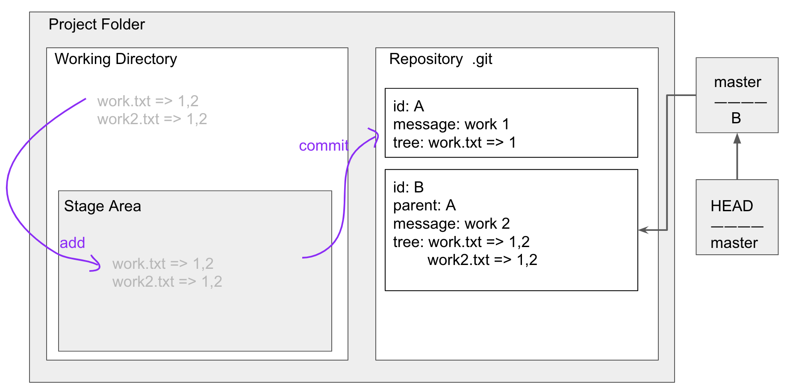

지옥에서 온 GIT  
===
스파크플러스 역삼2호점    
2019-10-08(화) 14:00 - 18:00  
이고잉님 !  

:깃은 차세대 버전관리 시스템    

평소 commit, push, branch, merge만 사용하는데 이 기회에 다시 한번 정리도 하고 까먹은 기능도 기억해낼겸 강의 참석   

```   
 http://bit.ly/git-src-tree
```
```
https://seomal.org/
```
#### 목표
1. 걸음마 배우기  
2. 불편함 극복하기  

rebase 등 혁신적인 건 구경만....... ? ㅠㅠ   

<hr/>
리누스 토발즈가 깃(&리눅스) 만듦    

### GIT 이전에는 어떻게 관리를 했는가?  
```  
work.txt  
work-최종.text  
work-최종-진짜최종.text  
work-최종-진짜최종-최종일리가.text  
``` 
- 문제점..
어떤게 최종인지 명확하지 않음. 파일의 이름을 더럽히고 싶지 않다    
시간관리도 안됌  


현재 4세대 까지 나옴 ->> 복잡해!


### 버전관리 도입  

 - work1 디렉토리 생성 후 소스트리 local Repository 연결하기 
 - .git 디렉토리 생성되어 있다 
 - 새 파일 work.txt 만들기
 - Commit -> 작업한 내용을 제출 

 - work2.txt, work3.txt 만들어서 여러개 관리해보기


### GIT 의 원리  

- 프로젝트 폴더 생성 
- .git 저장소 생성(repository)
- .git 디렉토리를 제외한 공간을 working directory 
- project folder 
  - working dir
    - stage area : 스테이지 저장소, 커밋 대기소, 선택적 커밋
  - repository.git : id, message, tree(stage area snapshot)

- working dir에 있는걸 stage area에 올리는걸 add 한다고 말함
- stage area 에 있는걸 repository에 올리는걸 commit 한다고 말함
- 즉, working dir -> statge area -> repository
- 헤드는 마스터를 경유해서 아이디를 겨냥함
- stage area가 트리가 되는거임
- 깃이 해쉬를 통해서 값을 만들면 그게 커밋아이디임
- 커밋하면 마스터가 가리키는 아이디 값이 바뀜!!
- parent는 헤드가 가리켰던애

repository.git
```
id: A 
message:work1 
tree(stage area snapshot): work.txt => 1
```
```
id: B 
parent: A
message:work2 
tree(stage area snapshot): 
work.txt => 1,2
work2.txt => 2
```
```
id: C 
parent: B
message:work3 
tree(stage area snapshot): 
-- work.txt => 1,2
-- work2.txt => 2
work3.txt => 3
```
- 위와 같은 방식으로 깃이 관리됨

### 복원하기(checkout)   
1. `깃 체크아웃은 head를 바꾼다`    
2. head가 가리키고있는 tree 내용을 stage area로 바꿔버림  
3. 이때 마스터(branch)를 경우해서 가리키는게 아니라 헤드가 직접 가리킨다 !!!!!! (이를 헤드가 브랜치로부터 detached 되어있는 상태라고 말한다.)  
4. 마스터는 마지막 커밋을 가르킴  
5. 헤드가 마스터를 가르키지 않으면 detached 된 버전임  
6. dettached 상태는 지양한다. 버전을 잊어버릴 가능성이 크기 때문이다.  
7. 다시 헤드가 마스터를 가르키게 하는게 attached, git checkout master  
8. 웬만하면 attached 상태에서 커밋을 하자  


### dettached 상태에서 커밋을 진행한다면?  
- 위험하다  
- 디태치 상태에서 커밋하면 브랜치를 통해 가리키는게 아니라 헤드가 가리키는애가 직접 변한다. 
- 이후 마스터로 체크아웃하면 헤드에서 만들었던 애들은 없어진다..! 


### 커밋 지우기(reset)
- reset은 삭제, 복원 두 가지 기능이 있음
- `reset은 해드가 가르키는 브랜치를 바꾼다`  
- ```head -> master -> C``` 일 때  ```git reset B``` 하면 ```head -> master -> B``` 임. (그렇게 하면) C는 이제 안보이니, 삭제된거 처럼 보임!
- 근데 어떻게 되돌리지? ```git reflog``` 하면 내가 여태 했던 히스토리를 볼 수 있는데 바로 전 단계의 commit 메세지 가져와서 reset 해주면 된다.
- ```git reset --hard e7f0bcf```


### Branch  
- 실험을 하고 싶으면 새로운 브랜치를 생성하자 
- 마지막 변경 사항 C를 가리키는 exp 브랜치 생성
- ```head checkout exp``` 하고 실험을 하다가 망하면 ..! ```head checkout master``` 로 돌아와서 exp 브랜치를 버리자 
- 여럿이서 개발 할 때 꼭 필요함

### 병합(merge)
- 병합할때는 방향이 중요  
- 병합된 버전을 만들고 자동으로 커밋(Merge branch 'exp')해주고 병합된 브랜치 가리킴  
- 여러 실험으로 경험치를 얻자  
- 비교할때 뭉텅이로 한다  
- auto merge가 되어야 잘 이용하는거다  
- 병합할 2개만 놓고 비교한다. (master, exp branch) (2 way merge)
- 병합할 때 각각 브랜치의 ```공통 브랜치```를 찾아서 베이스 깃발을 꽂는다. (master, exp, base branch)(3 way merge)
- 양쪽이 같은 곳을 수정할 때만 충돌이 발생한다.   

예시  
``` 
-
-
e1
-
-
-
m1
-
<<<<<<< HEAD
-
M2
=======
e2
-
>>>>>>> exp
-
```    

- ```git mergetool```을 이용하면 충돌을 해결하기가 수월하다

 


### Remote 저장소   
- 내 컴퓨터 지역 저장소 local repo   
- 원격 저장소 remote repo   
- 지역저장소에 원경저장소 연결  
- 지역 저장소에서 원격 저장소로 업로드(push)  
- 새로운 지역 저장소를 만들고 싶으면 (pull)  
- 드랍박스는 자동 백업의 의미  
- 원격 저장소의 기본 브랜치 이름은 ```origin```
- clone 해서 원격 저장소를 가져오면 pull까지 같이 해줌
- ```origin/master``` 트랙킹 브랜치, 깃이 알아서 관리해주는 특별한 브랜치   
- ```origin/HEAD``` 원격저장소의 헤드가 이걸 가리키고 있다. 별로 중요한 애는 아닌듯 ..  
- 상대방이 업로드 했는데 내가 그 파일을 가지고있지 않으면 원격 저장소가 거절함. 그러니 pull 하고 push 하자  
- push하기 전에 ```pull하고 push하자```
- 일하면서 중요한 세 가지 협업, 도메인, 개발 
- 깃 명령어를 꼭 익히자. 문제가 생겼을 때 이를 해결하기 위해서는 명령어를 사용하기 때문에, 차차 익숙해지자


### 명령어  

- ```git init``` 저장소 만들어
- ```git status``` 저장소 현재 상태
- ```git add work.txt``` 스테이지에 올려
- ```git commit -m "work 1"``` 커밋해
- ```git log``` 히스토리 조회

```   
git checkout master
git reset B
git reflog
```  


<br/>  
<br/> 

### 용량이 엄청 커진다면?
수정된 파일만큼만 저장하고있다.   


깃은 소스코드 관리도구 이지만 데이터 분석도구로도 쓸 수 있다.! 

